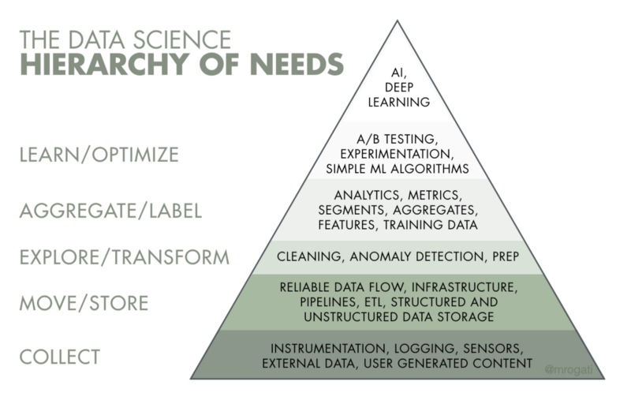

# Data Engineering
Data Engineering is a practice of sourcing and making data readily available for consumption in a reliable way.

In the Data Science Hierarchy of Needs, Data Engineering is located around the bottom to the 3rd Level.

## ETL
- ETL stands for Extract-Transform-Load
- Extract means extracting data from the source
- Transform means changing/shaping/cleaning the data
- Load means putting the data into the desired target location 
- Example:
  - Extract: Grabbing JSON data from a Data Lake (S3)
  - Transform: Parsing the JSON data and selecting some fields inside it
  - Load: Put the parsed JSON data into PostgreSQL db

## OLTP vs OLAP
- OLTP : OnLine Transactional Processing
  - Database optimized for transaction processing. 
  - Deals with operational data.
  - Meaning that it is optimized for row read/write.
  - Ex:
    - Postgres
- OLAP : OnLine Analytical Processing
  - Database optimized for analytics. 
  - Deals with historical / archived data.
  - Meaning that it is optimized for column aggregation.
  - Ex:
    - Redshift
    - Presto
  - Reference:
    - [Stack Overflow](https://stackoverflow.com/questions/21900185/what-are-oltp-and-olap-what-is-the-difference-between-them)

## Streaming vs Batch vs Micro-batch data processing
- Batch
  - Processing a number of data (typically large) on a certain schedule.
  - Typical tech:
    - Airflow
    - Hadoop / Spark
    - Cron
- Micro-batch
  - Processing a number of data in shorter time interval and smaller batches
  - This is very similar to stream
  - Ex:
    - Spark Streaming
- Streaming
  - Processing small chunks of data continuously
  - Ex:
    - Apache Storm
    - Apache Kafka
  - Difference between streaming and micro-batch:
    - numerous microbatch with very short interval (single or 2 digit miliseconds) might result in many jobs activated at once.
    - streaming is activated upon 1 job that runs continuously
      - probably streaming is event-based? (**need to check**)

## References:
- [Data Engineering 101](https://towardsdatascience.com/data-engineering-101-for-dummies-like-me-cf6b9e89c2b4)
- [Beginner Guide to Data Engineering](https://medium.com/@rchang/a-beginners-guide-to-data-engineering-part-i-4227c5c457d7)
- 